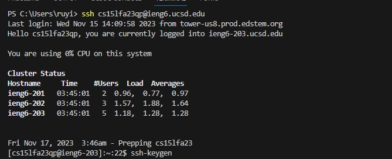
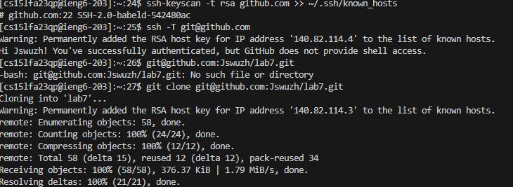
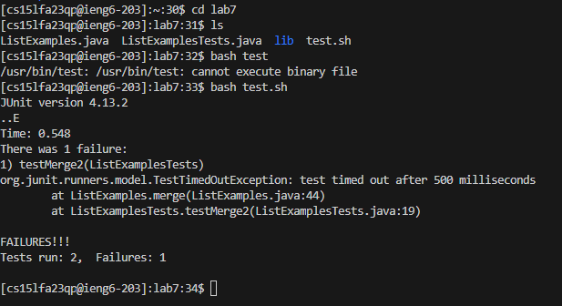
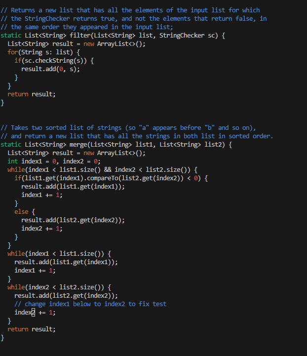
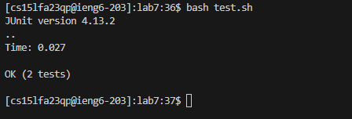
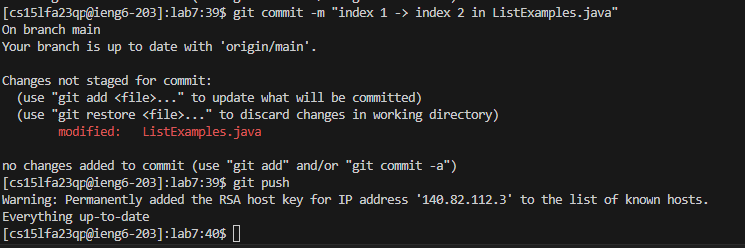

# Part 4: Login to ieng6

**Key Pressed:**

{

ssh`<space>` `<Right-Click>` (paste username) @ieng6.ucsd.edu `<enter>`

}

# Part 5: Clone

**Key Pressed:**

{

I go to github page, copy the ssh URL.

git`<space>`  clone`<space>`  `<Right-Click>` (paste URL) `<enter>`

}

# Part 6: Run the Test

**Key Pressed:**

{

cd`<space>`lab7`<enter>` (enter lab7 work directory) -> bash`<space>`test.sh`<enter>` (run the test)

}

# Part 7: Edit the code

**Key Pressed:**

{

vim`<space>`ListExamples.java `<enter>` (enter vim)

43j (I already count how many line need go to line need to be fixed, this step equal to `<j>` or `<down>` 43 times) 

11l (Same as previous command, to right 11, same as `<l>` or `<right>` 11 times)

x (delete 1)

i (enter insert-mode) -> 2 (add 2 after index)

`<Esc>` (back to normal-mode)

:wq (same all change and quit vim) `<enter>`

}

# Part 8: Run Test Again

**Key Pressed:**

{

`<up>` `<up>`  (the bash test.sh is in the 2 up in the history) `<enter>`

}

# Part 9: Commit and Push

**Key Pressed:**

{

git`<space>`commit`<space>`-m (-m is give the message)`<space>`"index`<space>` 1 `<space>`->`<space>` index`<space>` 2`<space>` in`<space>` ListExamples.java" `<enter>`

git`<space>`push`<enter>`

}
